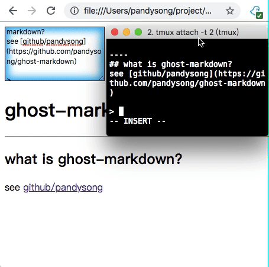

## ghost-markdown

markdown editor on an local html page. By using
[GhostText](https://github.com/GhostText/GhostText) One could edit a markdown
file in your favourate editor like
[vim](https://github.com/pandysong/ghost-text.vim), and get instante preview on
local html page.

## Thanks

Thanks to [markdown-js](https://github.com/evilstreak/markdown-js)
